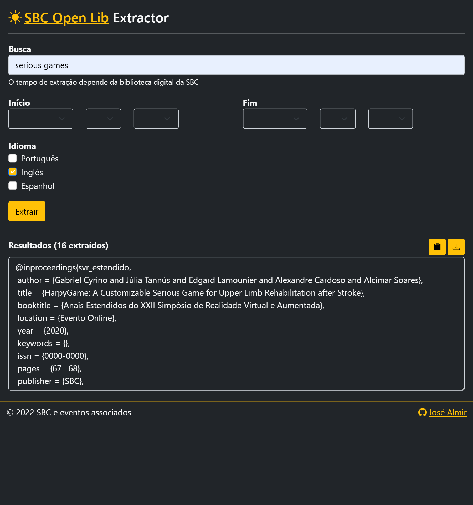
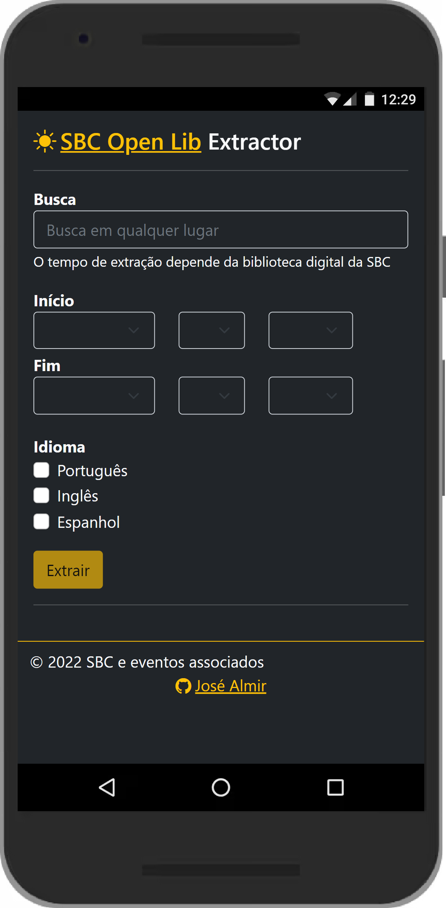

# SOLe
Ferramenta web de extração de referências bibtex de artigos da SBC Open Lib desenvolvida em ExpressJS

# UI

# API

[Documentação da API no Postman](https://documenter.getpostman.com/view/19006302/UVsPPQ2t)